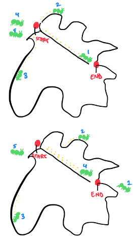

# Ant Colony Optimization Algorithm for Image Segmentation
<em>Cherry Pham and Vaani Bhatnagar</em>
## PROJECT STRUCTURE
* **algorithm.py**: Contains the ACO algorithm implementation
* **application.py**: Contains functions for image preprocessing and visualization
* **main.py**: Entry point for running the segmentation on an image
* **README.md**: Documentation for the project

## SET-UP INSTRUCTIONS
### Create a virtual environment
```
python -m venv venv
```

### Activate the virtual environment on macOS/Linux:
```
source venv/bin/activate
```

### Install dependencies
```
pip install -r requirements.txt
```

### Register the kernel with Jupyter
```
python -m ipykernel install --user --name=venv --display-name="Python (ACO Segmentation)"
```

## USAGE
Run the main script to segment an image:
```
python main.py
```
## Background of Algorithm

### Overview of Ant Colony Optimization (ACO)
Ant Colony Optimization (ACO) is a population-based metaheuristic inspired by the foraging behavior of ants. Marco Dorigo introduced it in the early 1990s to solve combinatorial optimization problems, particularly the Traveling Salesman Problem (TSP) and routing problems.

ACO models the way real ants find the shortest path between their nest and a food source using pheromone trails. Over time, ants reinforce shorter and more efficient paths by depositing pheromones, while longer and less efficient paths gradually lose pheromone strength due to evaporation.

### ACO as a Population-Based Metaheuristic
ACO belongs to the population-based metaheuristic family, meaning it uses a set of candidate solutions (ants) to explore the search space rather than refining a single solution iteratively. The key principles that make ACO a population-based approach include:

- **Multiple Ants as a Population**
  - Each ant constructs a solution independently, exploring different paths in parallel.
  - This allows ACO to maintain diversity in solution search, preventing premature convergence.
- **Exploration and Exploitation**
  - Ants probabilistically choose paths based on pheromone intensity and heuristic information (e.g., inverse distance in TSP).
  - Pheromone reinforcement encourages the exploitation of good solutions, while evaporation maintains exploration.
- **Dynamic Adaptation**
  - Unlike static algorithms, ACO evolves as it runs, with pheromone levels dynamically adjusting based on discovered solutions.
- **Parallelism and Scalability**
  - Since multiple ants explore solutions concurrently, ACO is naturally suited for parallel processing and large-scale optimization problems.

### Strengths of ACO

- **Exploration & Exploitation Balance** – Uses pheromone updates to balance between exploring new solutions and exploiting known good solutions.
- **Positive Feedback Mechanism** – Reinforces good solutions over time, leading to better convergence.
- **Parallelism** – Multiple ants explore solutions simultaneously, making it efficient for large-scale problems.
- **Adaptability** – Easily modified for various combinatorial problems like vehicle routing, scheduling, and network optimization.
- **Robustness** – Performs well even in dynamic environments where problem constraints may change.

## How Ant Colony Optimization Works

ACO simulates a colony of ants moving through a graph, looking for optimal paths. The process consists of the following steps:

1. **Graph Representation**
   - The problem is represented as a graph $G=(V,E)$, where:
     - $V$ = Nodes (e.g., cities in TSP)
     - $E$ = Edges (e.g., paths between cities)
   - Each edge has:
     - A pheromone level $\tau_{ij}$, which influences future ant movements.
     - A heuristic value $\eta_{ij}$ (e.g., the inverse of distance in TSP).

2. **Initialization**
   - Set initial pheromone values uniformly across all edges.
   - Define the number of ants $m$ to explore the graph.

3. **Ant Path Construction**
   - Each ant moves probabilistically based on pheromone trails and heuristic information using the probability equation:
     $$P_{ij} = \frac{(\tau_{ij})^{\alpha} (\eta_{ij})^{\beta}}{\sum_{k \in N} (\tau_{ik})^{\alpha} (\eta_{ik})^{\beta}}$$
     
   where:
     - $\tau_{ij}$ = pheromone level on edge $(i,j)$
     - $\eta_{ij}$ = heuristic information (e.g., inverse distance)
     - $\alpha$ = pheromone influence factor
     - $\beta$ = heuristic influence factor
     - $N$ = set of feasible nodes

4. **Pheromone Update**
   - After all ants complete their paths, pheromones are updated to reinforce good solutions and evaporate old trails using:
     $$\tau_{ij} = (1 - \rho) \tau_{ij} + \sum_{k=1}^{m} \Delta \tau_{ij}^{k}$$
     
   where:
     - $\rho$ = evaporation rate $( 0 < \rho < 1)$
     - $\Delta \tau_{ij}^{k}$ = pheromone deposited by ant $k$, calculated as:
       
       $$\Delta \tau_{ij}^{k} = \frac{Q}{L_k}$$
     - $Q$ = constant parameter
     - $L_k$ = total tour length of ant $k$

5. **Iteration & Convergence**
   - Repeat the process for several iterations.
   - The best path emerges as pheromone accumulates on optimal routes.
   - Stopping conditions: fixed iterations, stagnation, or time limit.

<p align="center">
  
</p>
<p align="center"><em> Figure 1: Diagram representation of Ant Colony Optimization (ACO)</em></p>

<p align="center">
  
</p>
<p align="center"><em> Figure 2: ACO Example</em></p>
An example case can be seen in Figure 2 where:
- Step 1: Ants 1, 2, and 3 mark possible trails from food to nest using their pheromones.
- Step 2: The pheromones for Ants 2 and 3 start evaporating, leading to the shortest path sustaining the most pheromones for other ants to be attracted to (Ant 1’s path).
- Step 3: Other ants (4 and 5) follow the pheromone trails, making the shortest trail accumulate more pheromones.
- Step 4: The shortest trail is reinforced through a feedback loop giving us our solution.


## Feature Comparison

| Feature | Ant Colony Optimization (ACO) | General Algorithms (Greedy, Brute Force, etc.) |
|---------|-------------------------------|----------------------------------------------|
| **Approach** | Stochastic, inspired by nature | Deterministic (fixed rules) or brute force |
| **Search Mechanism** | Pheromone-based probabilistic path selection | Step-by-step fixed decision-making |
| **Exploration** | Uses a pheromone-based adaptive search | Often rigid and exhaustive |
| **Efficiency** | Efficient for combinatorial problems | Greedy can be fast but suboptimal; brute force is slow |
| **Adaptability** | Can handle dynamic problem changes | Static, requires re-execution if conditions change |
| **Parallelism** | Multiple ants explore concurrently | Typically single-threaded or sequential |
| **Memory Usage** | Stores pheromone trails over time | Usually no memory of past searches |
| **Optimality** | Approaches near-optimal solutions | Greedy may get stuck in local optima; brute force finds the best but is impractical |

## Application: ACO in Image Segmentation
### ACO in the Real World: Image-segmentation
ACO is an effective technique for image segmentation, primarily used for edge detection. Among Digital Image Processing steps including Image Enhancement, Compression, and Morphological Processing, image segmentation is crucial in various fields such as medical imaging, object detection, and pattern recognition. Recent literature has highlighted ACO as a powerful technique for image segmentation, especially in use cases where precision and adaptability are critical. One of the most significant applications of ACO-based image segmentation is brain tumor detection, a task that requires high accuracy and robustness due to the complexity of medical images. Brain tumor detection involves identifying and delineating tumor regions from magnetic resonance imaging (MRI) scans, which is essential for diagnosis, treatment planning, and monitoring disease progression. ACO’s ability to produce continuous, thin, and clear edges makes it particularly suitable for this application.

Additionally, traditional segmentation techniques, such as thresholding or region-growing methods, struggle to effectively address MRI scans with noise, artifacts, and irregular shapes due to variations in tissue density, lighting, and imaging conditions. ACO, on the other hand, employs a probabilistic approach inspired by the foraging behavior of ants, enabling it to adaptively explore the image space and identify optimal edges even in the presence of noise and irregularities.

Some improved versions of ACO-based segmentation rely on extracting key features such as gray value, gradient, and pixel neighborhood information. These features are essential for distinguishing tumor regions from healthy tissues. For instance, tumors often appear as regions with distinct intensity values and gradients compared to surrounding tissues. The algorithm iterates for multiple cycles, refining segmentations progressively. The best segmentation found across all iterations—determined by the highest fitness score—is selected as the final segmented image. The resulting segmentation typically highlights object boundaries as thin, continuous edges. This iterative refinement ensures that the final segmentation is both accurate and reliable, which is critical for medical applications like brain tumor detection.

While ACO successfully extracts edges, it has some limitations, including slow runtime and restriction to grayscale images. These challenges can be addressed through hybrid approaches, such as integrating Artificial Bee Colony (ABC) algorithms for efficiency improvements or leveraging Human Visual System (HVS) models for better color segmentation. These modifications enhance ACO’s performance, making it more suitable for real-world applications.

### Modifying ACO for Image Segmentation
In ACO-based image segmentation, the image is represented as a graph where each pixel corresponds to a node, and edges connect neighboring pixels. In our application, we’re using an 8-neighbor model. The heuristic information for our application is derived from gradient magnitude, namely, the opacity of each pixel as opposed to its neighbors. The goal is to find the optimal set of paths that represents the boundaries of objects or regions within the image. As over-segmentation is a common issue in image segmentation, where the image is divided into too many small regions that make interpretation difficult, our ACO implementation uses morphological operations to fill gaps and remove small objects to simplify the main object regions within the image.

To increase the effectiveness of our image segmentation algorithm, we fine-tune the following parameters in our implementation function run_aco_segmentation() located in main().
- **n_segments**: More segments will create a more detailed segmentation.
- **ants**: More ants will explore more potential segmentation boundaries but increase computation time.
- **iterations**: More iterations give the algorithm more time to converge but increase computation time.
- **alpha**: Higher values give more importance to pheromone trails.
- **beta**: Higher values give more importance to edge information.
- **p**: Higher values cause faster pheromone evaporation.
- **q**: Higher values deposit more pheromone which leads to faster convergence.

Building off of the ACO formulas and methodologies detailed above, our algorithm goes through the following steps:
- Per each iteration, we initialize an array of all image segments (we limit the total number of segments for iteration to 5 for the sake of computing power, result generation speed, and segment clarity!)
- Use ACO to create each segment
  - Use k-means clustering to create an initial probability per pixel of the image (we increase the pheromone value for clustered segments and assigned positions with higher than 50% probability `high_prop_pos`).
  - Then, we deploy ants to explore with a limited number of steps (`max_steps`).
  - Each ant will choose its next position from an 8-neighborhood model based on the probability formula detailed in the section above, with pheromone value (`pheromone_val`) and (`heuristic_val`) being the key influence factors.
  - Then, clean segments are made from ant paths after being passed through morphological operations to clean up any small or trivial segments from ant paths. The segments with the highest probabilities are chosen.
- After the segments are created per iteration, our ACO model will continue to update pheromone deposit and evaporation as detailed in the above section. The probability map, initially created with k-means clustering, is then updated using a variation of the probability formula defined in the above section.
- All the clusterings are then masked onto the same image per iteration. 

In the jupyter notebook `imseg-ACO.ipynb` of our submission is an earlier iteration of our algorithm implementation. Here, we almost used pure ACO and was able to get a reasonable segmentation of the inputted image. However, the ants in this iteration were initialized at random positions, which meant they had to explore the entire image space without any prior knowledge about potential segment boundaries. K-means provides a more informed starting point by grouping similar pixels together based on intensity values. This creates reasonable initial "seeds" for each segment, giving the ACO algorithm a head start.

## Ethical Analysis
The integration of advanced algorithms in image segmentation in the medical field has revolutionized diagnostic and treatment processes, offering unprecedented opportunities for precision and efficiency. However, these advancements are accompanied by significant ethical challenges. A recurring theme in the literature highlights data quality and algorithm bias—which directly impacts the effectiveness of models—and data privacy as primary concerns, with various data protection frameworks, such as the one proposed by Kaur et al., offering potential solutions to address these issues. These issues, if unaddressed, can lead to misdiagnosis, discrimination, privacy breaches, and a loss of trust in healthcare systems. This section discusses these ethical concerns and proposes mitigation strategies, drawing on insights from recent literature.

### Data Quality and Algorithmic Bias
The effectiveness of models in medical image segmentation is heavily dependent on the quality of the data used for training. Poor data quality, such as incomplete, inaccurate, or unrepresentative datasets, can lead to biased algorithms that disproportionately affect certain patient populations. To mitigate these risks, it is essential to ensure that datasets are diverse and representative of the patient population. Rigorous data annotation and labeling processes must be implemented to maintain consistency and accuracy. Additionally, continuous monitoring and auditing of models are necessary to identify and address performance disparities across different patient groups. By prioritizing data quality and algorithmic fairness, healthcare providers can reduce the risk of biased outcomes and ensure equitable care for all patients.

### Data Privacy and Security
In addition, medical images contain sensitive patient information, making data privacy a critical ethical concern in the use of ACO for image segmentation. To address these concerns, robust data protection frameworks must be adopted. These frameworks should ensure compliance with privacy laws and ethical standards, such as those outlined in the EU Directive 95/46/EC. Advanced encryption techniques and anonymization methods should be employed to minimize the risk of privacy breaches. Furthermore, obtaining informed consent from patients is paramount. Patients must be fully informed about how their data will be used, and explicit consent should be obtained before data collection. By safeguarding patient privacy, healthcare providers can maintain trust and uphold the ethical principles of confidentiality and autonomy.

### Ethical and Legal Implications
The ethical principles of healthcare, such as beneficence, non-maleficence, and respect for patient autonomy, must be embedded in the design and implementation of algorithms in decision-making processes in the medical context. Legal accountability is another critical consideration. Clear guidelines must be established to address liability in cases of misdiagnosis or data misuse. Regulatory authorities must strengthen legal frameworks to address the ethical, legal, and socio-economic (ELSE) implications of AI in healthcare. Transparency and explainability in AI models are also essential. Healthcare providers must be able to understand and trust the decisions made by algorithms, which requires developing models that are both transparent and interpretable. 

## Bibliography
- Berry, Hugues, and Olivier Temam. "Modeling Self-Developing Biological Neural Networks." Neurocomputing, vol. 70, no. 16-18, 2007, pp. 2723-2734. Elsevier, DOI: 10.1016/j.neucom.2006.06.013.
- Blum, Christian, et al. "Ant Colony Optimization: Introduction and Recent Trends." Physics of Life Reviews, Elsevier, 21 Nov. 2005, DOI: 10.1016/j.plrev.2005.10.001.
- Dorigo, Marco. "Ant Colony Optimization." Scholarpedia, www.scholarpedia.org/article/Ant_colony_optimization. Accessed 7 Mar. 2025.
- Dorigo, Marco, and Thomas Stützle. "Ant Colony Optimization: Overview and Recent Advances." SpringerLink, Springer International Publishing, 1 Jan. 1970, DOI: 10.1007/978-3-319-91086-4_10.
- Dorigo, Marco, et al. "Ant Colony Optimization Theory: A Survey." Theoretical Computer Science, Elsevier, 2 Aug. 2005, DOI: 10.1016/j.tcs.2005.05.011.
- Hu, Mandong, et al. "Fuzzy System Based Medical Image Processing for Brain Disease Prediction." Frontiers in Neuroscience, vol. 15, 2021, article 714318. Frontiers, DOI: 10.3389/fnins.2021.714318.
Khorram, Bahar, and Mehran Yazdi. "A New Optimized Thresholding Method Using Ant Colony Algorithm for MR Brain Image Segmentation." Journal of Digital Imaging, vol. 32, no. 1, 2019, pp. 162-174. Springer, DOI: 10.1007/s10278-018-0111-x.
- Li, Y., H. Zhang, and L. Cheng. "A New Approach to Image Segmentation Based on Neutrosophic Filtering and Level Set Method." IEEE Transactions on Cybernetics, vol. 47, no. 10, 2017, pp. 3940-3951. IEEE, DOI: 10.1109/TCYB.2016.2618898.
- Maniezzo, Vittorio, and Antonella Carbonaro. "Ant Colony Optimization: An Overview." SpringerLink, Springer US, 1 Jan. 1970, DOI: 10.1007/978-1-4615-1507-4_21.
- Wang, Xiao-Nian, Yuan-Jing Feng, and Zu-Ren Feng. "Ant Colony Optimization for Image Segmentation." 2005 International Conference on Machine Learning and Cybernetics, vol. 9, IEEE, 2005, pp. 5355-5360. DOI: 10.1109/ICMLC.2005.1527890.
- IEEE Xplore Articles: "ANT Algorithms for Discrete Optimization." MIT Press Journals & Magazine, IEEE Xplore, ieeexplore.ieee.org/abstract/document/6787854. Accessed 7 Mar. 2025.  "Ant Colony Optimization." IEEE Journals & Magazine, IEEE Xplore, ieeexplore.ieee.org/abstract/document/4129846. Accessed 7 Mar. 2025.
